# BioBib Formatter — Architecture

```mermaid
---
title: BioBib Formatter — System Architecture
---
graph TB
    subgraph Browser["🌐 Browser (React 19 / MUI 7)"]
        direction TB
        UploadZone["Upload Zone\n• File drop zone\n• Review period selectors\n• Resume saved jobs"]
        ProgressGrid["Progress Grid\n• 20-slice status grid\n• Polls /api/status every 3s\n• 12-min timeout"]
        Results["Results Summary\n• Section completion\n• Gap analysis\n• Review notes"]
        Download["Download\n• Streams final .docx"]
        LocalStorage["localStorage\n• Saved jobId\n• Recovery on reload"]
    end

    subgraph NextJS["Next.js 16 App Router (Vercel Serverless)"]
        direction TB
        Pages["Pages"]
        API["API Routes"]

        subgraph Pages
            Home["/ (page.tsx)\nClient Component\nSingle-page app"]
            About["/about\nRelease notes, FAQ"]
        end

        subgraph API_Routes
            UploadToken["POST /api/upload-token\n• Mints client-direct\n  Blob upload token"]
            Upload["POST /api/upload\n• Validates blob URL\n• Parses .docx (mammoth)\n• Writes manifest + cv.txt\n• Dispatches 20 slice workers\n• Returns 202 { jobId }"]
            SliceWorker["POST /api/slice/:jobId/:key\n× 20 parallel workers (600s)\n• Reads cv.txt from Blob\n• Calls TritonAI per section\n• Writes slice result to Blob\n• Last slice triggers finalize"]
            Finalize["POST /api/finalize/:jobId\n• Blob-backed distributed lock\n• Merges 20 slice results\n• Deduplicates & renumbers\n• Generates .docx (docx lib)\n• Writes result + status"]
            Status["GET /api/status/:jobId\n• Derives progress from Blob keys\n• Self-healing: auto-kicks finalize\n  if all slices done but missed"]
            DownloadRoute["GET /api/download/:jobId\n• Streams biobib.docx\n• Public-by-jobId"]
        end

        Auth["Internal Auth\n• Shared secret header\n• Constant-time comparison"]
    end

    subgraph Storage["Vercel Blob (Object Storage)"]
        direction TB
        Manifest["jobs/&lt;jobId&gt;/manifest.json\n• fileName, model, dates"]
        CV["jobs/&lt;jobId&gt;/cv.txt\n• Parsed CV text"]
        Slices["jobs/&lt;jobId&gt;/slice-&lt;key&gt;.json\n• Per-section AI results"]
        Lock["jobs/&lt;jobId&gt;/finalize.lock\n• Timestamp-based lock\n• Stale after 90s"]
        Result["jobs/&lt;jobId&gt;/result.json\n• Merged ConversionResult"]
        Docx["jobs/&lt;jobId&gt;/biobib.docx\n• Final generated document"]
        StatusBlob["jobs/&lt;jobId&gt;/status.json\n• Terminal status"]
    end

    subgraph AI["UCSD TritonAI (LiteLLM Gateway)"]
        direction TB
        CloudModel["Cloud: gpt-5.5\n(higher fidelity)"]
        OnPremModel["On-Prem: api-gpt-oss-120b\n(cost-controlled)"]
        Routing["Model Routing\n• High-fidelity slices → cloud first\n• Cost-controlled → on-prem first\n• Fallback chain on failure"]
    end

    subgraph Libraries["Key Libraries"]
        Mammoth["mammoth\n• .docx → plain text"]
        JSZip["jszip\n• Rich text extraction\n• Superscript/subscript"]
        DocxLib["docx (npm)\n• Programmatic .docx gen"]
    end

    %% Data Flow: Step 1 - Upload
    Browser -->|"1. POST /api/upload-token"| UploadToken
    UploadToken -->|"Returns SAS token"| Browser
    Browser -->|"2. Upload .docx to Blob"| Storage

    %% Data Flow: Step 2 - Dispatch
    Browser -->|"3. POST { blobUrl, fileName }"| Upload
    Upload -->|"4a. Fetch & parse .docx"| CV
    Upload -->|"4b. Write manifest"| Manifest
    Upload -->|"4c. Delete source blob"| Storage
    Upload -->|"5. POST × 20 (background via after())"| SliceWorker

    %% Data Flow: Step 3 - AI Slicing
    SliceWorker -->|"Read cv.txt"| CV
    SliceWorker -->|"POST section prompt"| AI
    AI -->|"Returned structured data"| SliceWorker
    SliceWorker -->|"Write slice-&lt;key&gt;.json"| Slices
    SliceWorker -->|"Last slice triggers"| Finalize

    %% Data Flow: Step 4 - Merge & Generate
    Finalize -->|"Acquire lock"| Lock
    Finalize -->|"Read all slices"| Slices
    Finalize -->|"Write result.json"| Result
    Finalize -->|"Write biobib.docx"| Docx
    Finalize -->|"Write status.json"| StatusBlob

    %% Data Flow: Step 5 - Poll
    Browser -->|"6. GET /api/status/:jobId every 3s"| Status
    Status -->|"Probe slice keys"| Slices
    Status -->|"Auto-kick if stale"| Finalize
    Status -->|"Return progress/results"| Browser

    %% Data Flow: Step 6 - Download
    Browser -->|"7. GET /api/download/:jobId"| DownloadRoute
    DownloadRoute -->|"Stream biobib.docx"| Docx
    DownloadRoute -->|"Binary stream"| Browser

    %% Styling
    classDef browser fill:#e1f5fe,stroke:#01579b,stroke-width:2px
    classDef nextjs fill:#fff3e0,stroke:#e65100,stroke-width:2px
    classDef storage fill:#e8f5e9,stroke:#1b5e20,stroke-width:2px
    classDef ai fill:#f3e5f5,stroke:#4a148c,stroke-width:2px
    classDef lib fill:#fce4ec,stroke:#880e4f,stroke-width:2px
    classDef api fill:#fff8e1,stroke:#f57f17,stroke-width:1px

    class Browser,UploadZone,ProgressGrid,Results,Download,LocalStorage browser
    class NextJS,Pages,Home,About,API,API_Routes nextjs
    class UploadToken,Upload,SliceWorker,Finalize,Status,DownloadRoute api
    class Storage,Manifest,CV,Slices,Lock,Result,Docx,StatusBlob storage
    class AI,CloudModel,OnPremModel,Routing ai
    class Mammoth,JSZip,DocxLib lib
```



## Pipeline Overview

```
┌─────────────────────────────────────────────────────────────────────────────┐
│                        6-STEP ASYNC PIPELINE                                │
├──────────┬──────────────────────────────────────────────────────────────────┤
│ Step 1   │ Browser uploads .docx directly to Vercel Blob                   │
│          │ (bypasses 4.5MB serverless body limit)                          │
├──────────┼──────────────────────────────────────────────────────────────────┤
│ Step 2   │ /api/upload validates blob, parses CV, writes manifest,         │
│          │ dispatches 20 parallel slice workers via after()                 │
├──────────┼──────────────────────────────────────────────────────────────────┤
│ Step 3   │ 20 /api/slice workers each call TritonAI for one section        │
│          │ (600s maxDuration per worker)                                   │
├──────────┼──────────────────────────────────────────────────────────────────┤
│ Step 4   │ Last slice worker triggers /api/finalize which merges all       │
│          │ slices, deduplicates, renumbers, and generates .docx            │
├──────────┼──────────────────────────────────────────────────────────────────┤
│ Step 5   │ Client polls /api/status every 3s — self-healing detects       │
│          │ and re-kicks finalize if missed                                 │
├──────────┼──────────────────────────────────────────────────────────────────┤
│ Step 6   │ Client downloads final BioBib .docx via /api/download           │
└──────────┴──────────────────────────────────────────────────────────────────┘
```

## Key Design Decisions

| Decision | Rationale |
|---|---|
| **No database** | All state in Vercel Blob objects — append-only, status derived by probing keys |
| **No user auth** | Job UUID is the access token; internal API uses shared secret |
| **20 parallel AI slices** | Splits CV extraction by section/year — each has own serverless function budget |
| **Blob-backed distributed lock** | `put()` with `allowOverwrite: false` prevents concurrent finalize |
| **Self-healing status** | `/api/status` auto-kicks `/api/finalize` if slices done but merge missed |
| **Model routing with fallback** | High-fidelity slices prefer cloud → on-prem; cost-sensitive reverse |
| **`after()` for background dispatch** | Next.js 16 API — returns 202 immediately while workers run in background |
```
